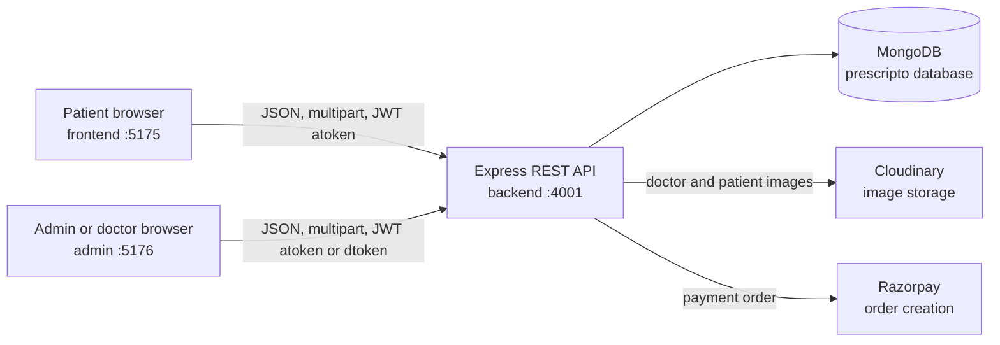
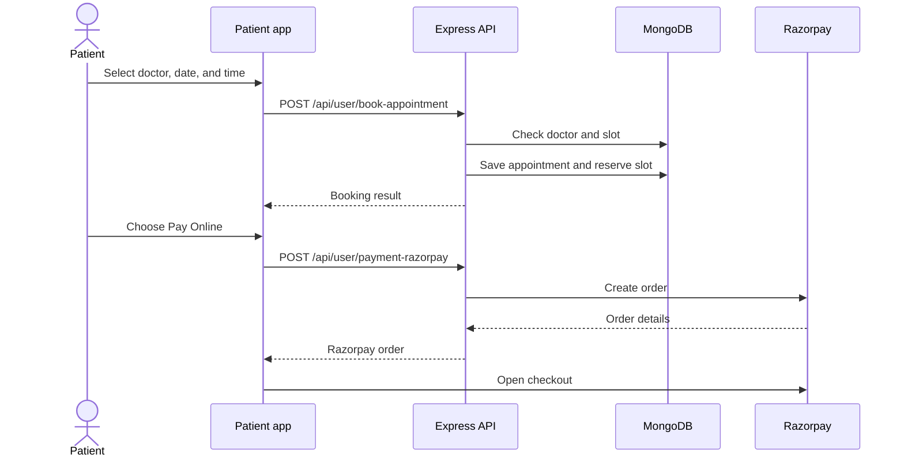
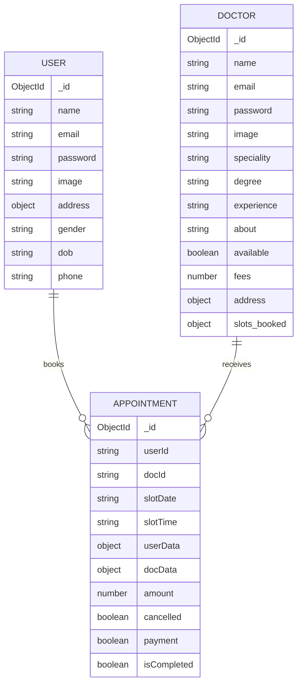

# Prescripto

Prescripto is a full-stack hospital appointment management system. It provides a public patient experience for discovering doctors and booking appointments, plus a shared staff portal for administrators and doctors.

The project is organized as three independently runnable applications:

- `frontend`: React patient web application
- `admin`: React admin and doctor portal
- `backend`: Express REST API with MongoDB persistence

## Contents

- [Features](#features)
- [Architecture](#architecture)
- [Project Structure](#project-structure)
- [Technology Stack](#technology-stack)
- [Prerequisites](#prerequisites)
- [Configuration](#configuration)
- [Installation and Running](#installation-and-running)
- [Application Routes](#application-routes)
- [API Reference](#api-reference)
- [Data Model](#data-model)
- [Authentication](#authentication)
- [Booking and Payment Flow](#booking-and-payment-flow)
- [Known Implementation Notes](#known-implementation-notes)
- [Security Notes](#security-notes)
- [Validation](#validation)

## Features

### Patient application

- Register and sign in with email and password
- Browse doctors and filter by speciality
- View doctor profile, experience, fees, availability, and address
- Generate seven days of 30-minute appointment slots
- Book an available appointment
- View and cancel personal appointments
- Start an online Razorpay payment order
- View and edit profile information, including profile image upload

### Admin portal

- Admin sign in using configured administrator credentials
- Dashboard totals for doctors, patients, and appointments
- Add doctors with profile image upload
- List doctors and change their availability
- View all appointments
- Cancel appointments and release the associated doctor slot

### Doctor portal

- Doctor sign in
- Dashboard with earnings, appointment count, patient count, and latest bookings
- View assigned appointments
- Mark appointments as completed
- Cancel assigned appointments
- View and update profile information, fees, address, bio, and availability

## Architecture



The backend owns authentication, validation, appointment slot allocation, appointment state changes, image uploads, and payment-order creation. The React applications hold role-specific UI state in Context providers and call the API with Axios.

### Appointment lifecycle



## Project Structure

```text
Prescripto/
├── backend/
│   ├── config/              # MongoDB and Cloudinary setup
│   ├── controllers/         # User, doctor, and admin business logic
│   ├── middleware/          # JWT auth and Multer upload middleware
│   ├── models/              # Mongoose schemas
│   ├── routes/              # REST route definitions
│   ├── server.js            # Express entry point
│   ├── package.json
│   └── .env                 # Local secrets; ignored by Git
├── frontend/
│   ├── src/components/      # Patient-facing UI components
│   ├── src/context/         # Patient API and session state
│   ├── src/pages/            # Patient pages
│   ├── src/App.jsx
│   ├── vite.config.js       # Development port 5175
│   └── package.json
├── admin/
│   ├── src/components/      # Staff navigation and layout
│   ├── src/context/         # Admin and doctor API state
│   ├── src/pages/Admin/      # Admin screens
│   ├── src/pages/Doctor/     # Doctor screens
│   ├── src/App.jsx
│   ├── vite.config.js       # Development port 5176
│   └── package.json
└── README.md
```

## Technology Stack

| Area | Technology |
| --- | --- |
| Patient UI | React 19, React Router, Vite, Tailwind CSS, Axios, React Toastify |
| Staff UI | React 19, React Router, Vite, Tailwind CSS, Axios, React Toastify |
| API | Node.js, Express 5, CORS |
| Database | MongoDB with Mongoose |
| Authentication | JSON Web Tokens and bcrypt |
| Images | Multer temporary uploads and Cloudinary |
| Payments | Razorpay order API |
| Validation | Validator package and controller-level checks |

## Prerequisites

- Node.js 18 or newer
- npm
- A MongoDB database
- A Cloudinary account
- A Razorpay account for payment-order creation

## Configuration

Create environment files locally. Never commit real credentials.

### `backend/.env`

```env
PORT=4001
MONGODB_URI=mongodb+srv://<username>:<password>@<cluster>/<database>
CLOUDINARY_NAME=<cloudinary-cloud-name>
CLOUDINARY_API_KEY=<cloudinary-api-key>
CLOUDINARY_SECRET_KEY=<cloudinary-api-secret>
JWT_SECRET=<long-random-secret>
ADMIN_EMAIL=admin@example.com
ADMIN_PASSWORD=<strong-admin-password>
RAZORPAY_KEY_ID=<razorpay-key-id>
RAZORPAY_KEY_SECRET=<razorpay-key-secret>
CURRENCY=INR
```

The API appends `/prescripto` to `MONGODB_URI` when connecting, so provide the MongoDB URI without that database suffix.

### `frontend/.env`

```env
VITE_BACKEND_URL=http://localhost:4001
VITE_RAZORPAY_KEY_ID=<razorpay-key-id>
```

### `admin/.env`

```env
VITE_BACKEND_URL=http://localhost:4001
```

The current React contexts use the deployed Render API URL directly. To run entirely against a local backend, replace that hardcoded value with `import.meta.env.VITE_BACKEND_URL` in the contexts, or update the deployment configuration accordingly.

## Installation and Running

Install dependencies in each application:

```bash
cd backend
npm install

cd ../frontend
npm install

cd ../admin
npm install
```

Run the API:

```bash
cd backend
npm start
```

For development with automatic restart:

```bash
npm run server
```

Run the patient application in a second terminal:

```bash
cd frontend
npm run dev
```

Run the staff application in a third terminal:

```bash
cd admin
npm run dev
```

Default local URLs:

| Application | URL |
| --- | --- |
| API health check | `http://localhost:4001/` |
| Patient app | `http://localhost:5175/` |
| Admin/doctor portal | `http://localhost:5176/` |

Production builds can be created independently with `npm run build` inside `frontend` or `admin`.

## Application Routes

### Patient app

| Route | Purpose |
| --- | --- |
| `/` | Home page |
| `/doctors` | Browse all doctors |
| `/doctors/:speciality` | Browse doctors by speciality |
| `/appointment/:docId` | Doctor details and booking slots |
| `/login` | Patient registration and login |
| `/my-profile` | Patient profile |
| `/my-appointments` | Patient appointments and payment actions |
| `/about` | About page |
| `/contact` | Contact page |

### Staff portal

| Route | Purpose |
| --- | --- |
| `/admin-dashboard` | Admin metrics and latest appointments |
| `/all-appointments` | All appointments for admin |
| `/add-doctor` | Create a doctor profile |
| `/doctor-list` | List doctors and availability |
| `/doctor-dashboard` | Doctor metrics and latest bookings |
| `/doctor-appointments` | Doctor appointment management |
| `/doctor-profile` | Doctor profile management |

## API Reference

Base URL: `http://localhost:4001` (or the deployed backend URL).

Successful and failed controller responses generally use JSON with a boolean `success` property. Errors are commonly returned as `{ "success": false, "message": "..." }`.

### Health

| Method | Endpoint | Auth | Description |
| --- | --- | --- | --- |
| `GET` | `/` | None | Returns `API working !!!` |

### User endpoints

Authenticated user requests use the `atoken` header.

| Method | Endpoint | Body or form fields | Description |
| --- | --- | --- | --- |
| `POST` | `/api/user/register` | JSON: `name`, `email`, `password` | Create a patient account and return a JWT |
| `POST` | `/api/user/login` | JSON: `email`, `password` | Authenticate a patient and return a JWT |
| `GET` | `/api/user/get-profile` | `atoken` header | Return the authenticated patient without the password |
| `POST` | `/api/user/update-profile` | Multipart: `name`, `phone`, `address` JSON, `dob`, `gender`, optional `image` | Update patient details and optionally upload an image |
| `POST` | `/api/user/book-appointment` | JSON: `docId`, `slotDate`, `slotTime` | Reserve a doctor slot and create an appointment |
| `GET` | `/api/user/appointments` | `atoken` header | List the authenticated patient's appointments |
| `POST` | `/api/user/cancel-appointment` | JSON: `appointmentId` | Cancel a patient's appointment and release the slot |
| `POST` | `/api/user/payment-razorpay` | JSON: `appointmentId` | Create a Razorpay order for a non-cancelled appointment |

### Doctor endpoints

Authenticated doctor requests use the `dtoken` header.

| Method | Endpoint | Body or form fields | Description |
| --- | --- | --- | --- |
| `GET` | `/api/doctor/list` | None | Return public doctor data without email or password |
| `POST` | `/api/doctor/login` | JSON: `email`, `password` | Authenticate a doctor and return a JWT |
| `GET` | `/api/doctor/appointments` | `dtoken` header | List appointments assigned to the doctor |
| `POST` | `/api/doctor/complete-appointment` | JSON: `appointmentId` | Mark an assigned appointment completed |
| `POST` | `/api/doctor/cancel-appointment` | JSON: `appointmentId` | Cancel an assigned appointment |
| `GET` | `/api/doctor/dashboard` | `dtoken` header | Return earnings, appointment count, patient count, and latest appointments |
| `GET` | `/api/doctor/profile` | `dtoken` header | Return the authenticated doctor's profile without the password |
| `POST` | `/api/doctor/update-profile` | JSON: `fees`, `address`, `about`, `available` | Update editable doctor profile fields |

### Admin endpoints

Authenticated admin requests use the `atoken` header. The admin token is generated from the configured admin credentials and signed with `JWT_SECRET`.

| Method | Endpoint | Body or form fields | Description |
| --- | --- | --- | --- |
| `POST` | `/api/admin/login` | JSON: `email`, `password` | Authenticate the configured administrator |
| `POST` | `/api/admin/add-doctor` | Multipart: `name`, `email`, `password`, `speciality`, `degree`, `experience`, `about`, `fees`, `address` JSON, `image` | Create a doctor and upload the profile image |
| `POST` | `/api/admin/all-doctors` | `atoken` header | Return all doctors, excluding passwords |
| `POST` | `/api/admin/change-availability` | Intended input: doctor identifier | Toggle doctor availability |
| `GET` | `/api/admin/appointments` | `atoken` header | Return all appointments |
| `POST` | `/api/admin/cancel-appointment` | JSON: `appointmentId` | Cancel any appointment and release its slot |
| `GET` | `/api/admin/dashboard` | `atoken` header | Return doctor, patient, appointment, and latest booking totals |

## Data Model



Appointments store `userData` and `docData` snapshots in addition to `userId` and `docId`. This preserves the display data used by the current appointment screens but means later profile changes do not update existing appointment snapshots.

## Authentication

1. A patient or doctor logs in and receives a JWT signed with `JWT_SECRET`.
2. The patient app stores the token in local storage under `token`; the staff portal uses `atoken` for admin sessions and `dToken` for doctor sessions.
3. API requests send the token in the `atoken` or `dtoken` request header.
4. Middleware verifies the JWT and adds `req.userId` or `req.docId` before the controller runs.

Passwords are hashed with bcrypt before being stored. Password fields are excluded from profile and public doctor responses.

## Known Implementation Notes

These points are based on the current source code and are useful when deploying or extending the project:

- Razorpay order creation is implemented, but the payment verification handler is empty and is not exposed as a route. The frontend checkout callback only logs the Razorpay response, so the appointment `payment` flag is not currently confirmed by the server.
- The admin availability client currently calls `GET /api/admin/change-availability` and does not pass the doctor ID in the expected place, while the backend route is `POST` and the controller reads `docId` from the authenticated request. This flow should be aligned before relying on the availability checkbox.
- The frontend and admin contexts currently use a hardcoded deployed backend URL. The `VITE_BACKEND_URL` variables are present but commented out in the source contexts.
- The API enables open CORS with `cors()` and has no centralized error handler or request schema validation layer.
- JWTs are stored in browser local storage. Production deployments should evaluate an HttpOnly cookie strategy and add token expiry and refresh behavior.
- Appointment booking and slot release are separate database operations. A production version should use stronger concurrency protection or a transaction to prevent race conditions for simultaneous bookings.
- There are no automated tests in the backend package; its `test` script is a placeholder.

## Security Notes

- Keep `.env` files out of source control. The repository `.gitignore` already excludes backend and frontend environment files.
- Use a long random `JWT_SECRET`, a strong admin password, and production credentials managed by the deployment platform.
- Use Razorpay test keys for local development and keep secret keys server-side.
- Restrict CORS to the deployed patient and staff origins before production use.
- Validate and authorize every appointment state transition on the server, including payment confirmation.
- Rotate any credential that has ever been committed, shared, or exposed in logs.

## Validation

Run the available checks from each React application:

```bash
cd frontend
npm run lint
npm run build

cd ../admin
npm run lint
npm run build
```

Start the backend with `npm start` and request `GET /` to verify that the API is reachable. The backend currently does not provide an automated test suite.

## License

No license has been declared in the package manifests yet. Add a repository license before distributing Prescripto publicly.
